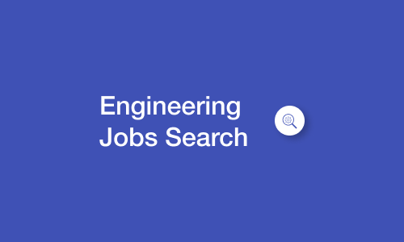

<!-- Improved compatibility of back to top link: See: https://github.com/Arm0ny/Engineering-jobs-search/pull/73 -->
<a name="readme-top"></a>
<!--
*** Thanks for checking out the Best-README-Template. If you have a suggestion
*** that would make this better, please fork the repo and create a pull request
*** or simply open an issue with the tag "enhancement".
*** Don't forget to give the project a star!
*** Thanks again! Now go create something AMAZING! :D
-->


<!-- PROJECT SHIELDS -->
<!--
*** I'm using markdown "reference style" links for readability.
*** Reference links are enclosed in brackets [ ] instead of parentheses ( ).
*** See the bottom of this document for the declaration of the reference variables
*** for contributors-url, forks-url, etc. This is an optional, concise syntax you may use.
*** https://www.markdownguide.org/basic-syntax/#reference-style-links
-->
[![Contributors][contributors-shield]][contributors-url]
[![Forks][forks-shield]][forks-url]
[![Stargazers][stars-shield]][stars-url]
[![Issues][issues-shield]][issues-url]
[![MIT License][license-shield]][license-url]
[![LinkedIn][linkedin-shield]][linkedin-url]


<!-- PROJECT LOGO -->
<br />
<div align="center">
  <a href="https://github.com/Arm0ny/Engineering-jobs-search">
    
  </a>

  <h3 align="center">Best-README-Template</h3>

  <a style="border: 3px solid; text-align: center; padding: 8px 16px">Try It Out</a>

  <p align="center">
    An awesome README template to jumpstart your projects!
    <br />
    <a href="https://github.com/Arm0ny/Engineering-jobs-search"><strong>Explore the docs »</strong></a>
    <br />
    <br />
    <a href="https://github.com/Arm0ny/Engineering-jobs-search">View Demo</a>
    ·
    <a href="https://github.com/Arm0ny/Engineering-jobs-search/issues">Report Bug</a>
    ·
    <a href="https://github.com/Arm0ny/Engineering-jobs-search/issues">Request Feature</a>
  </p>
</div>


<!-- TABLE OF CONTENTS -->
<details>
  <summary>Table of Contents</summary>
  <ol>
    <li>
      <a href="#about-the-project">About The Project</a>
      <ul>
        <li><a href="#built-with">Built With</a></li>
      </ul>
    </li>
    <li>
      <a href="#getting-started">Getting Started</a>
      <ul>
        <li><a href="#prerequisites">Prerequisites</a></li>
        <li><a href="#installation">Installation</a></li>
      </ul>
    </li>
    <li><a href="#usage">Usage</a></li>
    <li><a href="#roadmap">Roadmap</a></li>
    <li><a href="#contributing">Contributing</a></li>
    <li><a href="#license">License</a></li>
    <li><a href="#contact">Contact</a></li>
    <li><a href="#acknowledgments">Acknowledgments</a></li>
  </ol>
</details>


<!-- ABOUT THE PROJECT -->
## About The Project

[![Product Name Screen Shot][product-screenshot]](https://example.com)

A little project made using Angular that makes esier search for engineering jobs all around the World!

<p align="right">(<a href="#readme-top">back to top</a>)</p>


### Built With

* [![Angular][Angular.io]][Angular-url]
* ![TypeScript]


<p align="right">(<a href="#readme-top">back to top</a>)</p>


<!-- GETTING STARTED -->
## Getting Started
to use this project locally you need to install clone the repository and install all the dependencies to start a development server on your local networc

to do this you can follow those steps:
1. clone the repository
```sh
git clone https://github.com/Arm0ny?tab=repositories
```

### Prerequisites

2. install dependencies with:
```sh
npm install
```

make sure you have angular-cli installed locally with:
```sh
ng version
```
otherwise install it with:
```sh
npm install -g @angular/cli
```

### Running a local server

to start the server ad use the application you can run:
```sh
ng serve
```
a message with the local server URL should appear on your console, navigate to that to open the app into the browser

<p align="right">(<a href="#readme-top">back to top</a>)</p>


<!-- USAGE EXAMPLES -->
## Usage

when you open the app you are prompted to the home page showing the active jobs announces for the **Rome, Italy** location like this:

[![Product Name Screen Shot][product-screenshot]](https://example.com)

to get more infos on a selected job you can click the **_see more_** button on the bottom of each card.


Your view will change to show the announce's details like this:

![details-screenshot]


As you can see the company name is a button element, click on it to get insormations on the company whose published the announce:

![company-details-screenshot]

### Setting Filters
in the home page you can set custom research filters using the form at the top of the page:

![filters-form-screenshot]

inside the **_city Field_** format the filter as shown in the example  
**NB: uppercase, spaces and commas MUST be respected**
_if the search returns wrong results, the "levels" field can be used independently, leaving the "city" field empty_


<!-- CONTRIBUTING -->
## Contributing

Contributions are what make the open source community such an amazing place to learn, inspire, and create. Any contributions you make are **greatly appreciated**.

If you have a suggestion that would make this better, please fork the repo and create a pull request. You can also simply open an issue with the tag "enhancement".
Don't forget to give the project a star! Thanks again!

1. Fork the Project
2. Create your Feature Branch (`git checkout -b feature/AmazingFeature`)
3. Commit your Changes (`git commit -m 'Add some AmazingFeature'`)
4. Push to the Branch (`git push origin feature/AmazingFeature`)
5. Open a Pull Request

<p align="right">(<a href="#readme-top">back to top</a>)</p>


<!-- LICENSE -->
## License

Distributed under the MIT License. See `LICENSE.txt` for more information.

<p align="right">(<a href="#readme-top">back to top</a>)</p>


<!-- CONTACT -->
## Contact

Project Link: [https://github.com/Armony/Engineering-jobs-search](https://github.com/your_username/repo_name)

Email: armando.pagano2001@gmail.com

website: [Link][website-link]

<p align="right">(<a href="#readme-top">back to top</a>)</p>


<!-- MARKDOWN LINKS & IMAGES -->
<!-- https://www.markdownguide.org/basic-syntax/#reference-style-links -->
[contributors-shield]: https://img.shields.io/github/contributors/Arm0ny/Engineering-jobs-search.svg?style=for-the-badge
[contributors-url]: https://github.com/Arm0ny/Engineering-jobs-search/graphs/contributors
[forks-shield]: https://img.shields.io/github/forks/Arm0ny/Engineering-jobs-search.svg?style=for-the-badge
[forks-url]: https://github.com/Arm0ny/Engineering-jobs-search/network/members
[stars-shield]: https://img.shields.io/github/stars/Arm0ny/Engineering-jobs-search.svg?style=for-the-badge
[stars-url]: https://github.com/Arm0ny/Engineering-jobs-search/stargazers
[issues-shield]: https://img.shields.io/github/issues/Arm0ny/Engineering-jobs-search.svg?style=for-the-badge
[issues-url]: https://github.com/Arm0ny/Engineering-jobs-search/issues
[license-shield]: https://img.shields.io/github/license/Arm0ny/Engineering-jobs-search.svg?style=for-the-badge
[license-url]: https://github.com/Arm0ny/Engineering-jobs-search/blob/master/LICENSE.txt
[linkedin-shield]: https://img.shields.io/badge/-LinkedIn-black.svg?style=for-the-badge&logo=linkedin&colorB=555
[linkedin-url]: https://www.linkedin.com/in/armando-pagano-67787916a
[website-link]: http://mando-webdev.web.app
[product-screenshot]: img/screenshot.png
[details-screenshot]: img/details-screenshot.png
[company-details-screenshot]: img/company-details-screenshot.png
[filters-form-screenshot]: img/filters-form-screenshot.png
[Next.js]: https://img.shields.io/badge/next.js-000000?style=for-the-badge&logo=nextdotjs&logoColor=white
[Next-url]: https://nextjs.org/
[React.js]: https://img.shields.io/badge/React-20232A?style=for-the-badge&logo=react&logoColor=61DAFB
[React-url]: https://reactjs.org/
[Vue.js]: https://img.shields.io/badge/Vue.js-35495E?style=for-the-badge&logo=vuedotjs&logoColor=4FC08D
[Vue-url]: https://vuejs.org/
[Angular.io]: https://img.shields.io/badge/Angular-DD0031?style=for-the-badge&logo=angular&logoColor=white
[Angular-url]: https://angular.io/
[Svelte.dev]: https://img.shields.io/badge/Svelte-4A4A55?style=for-the-badge&logo=svelte&logoColor=FF3E00
[Svelte-url]: https://svelte.dev/
[Laravel.com]: https://img.shields.io/badge/Laravel-FF2D20?style=for-the-badge&logo=laravel&logoColor=white
[Laravel-url]: https://laravel.com
[Bootstrap.com]: https://img.shields.io/badge/Bootstrap-563D7C?style=for-the-badge&logo=bootstrap&logoColor=white
[Bootstrap-url]: https://getbootstrap.com
[JQuery.com]: https://img.shields.io/badge/jQuery-0769AD?style=for-the-badge&logo=jquery&logoColor=white
[JQuery-url]: https://jquery.com
[TypeScript]: https://img.shields.io/badge/TypeScript-0769AD?style=for-the-badge&logo=typescript&logoColor=white
[HTML]: https://img.shields.io/badge/HTML5-000?style=for-the-badge&logo=html5&logoColor=
[CSS]:  https://img.shields.io/badge/CSS-0769AD?style=for-the-badge&logo=css3&logoColor=
